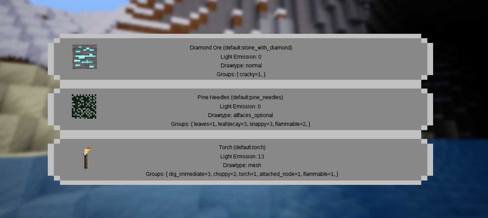

Node Information on_punch [punchinfo]
=======================================
* Licence: Code: MIT (see LICENSE), Media: CC-BY-SA 3.0
* [GitHub Repository](https://github.com/octacian/punchinfo)
* [Issue Tracker](https://github.com/octacian/punchinfo/issues)
* Dependencies: None.

This is another fairly simple utility mod, but it can serve a very useful purpose. PunchInfo was originally inspired by [azekill_DIABLO's NodeExploror mod](https://forum.minetest.net/viewtopic.php?f=9&t=15565). However, NodeExplorer was missing several features, and since it wasn't on GitHub, I decided to start over from scratch.

The concept of PunchInfo is very simple, whenever a player left-clicks (i.e. punches) a node, information about that node is shown. This information includes the description, itemstring, top texture, light emission level, drawtype, and groups. The HUD is removed after 2 seconds (configurable in `minetest.conf` with `punchnode.hud_show_time`, integer).